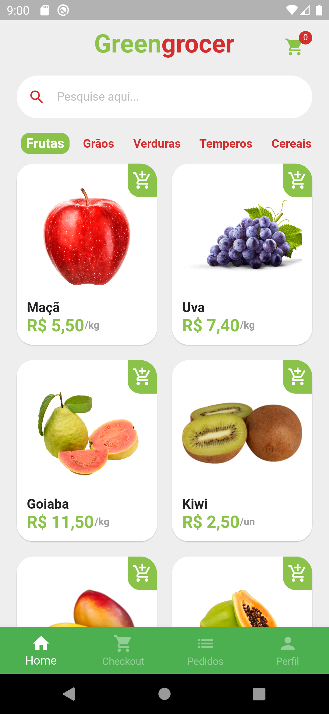
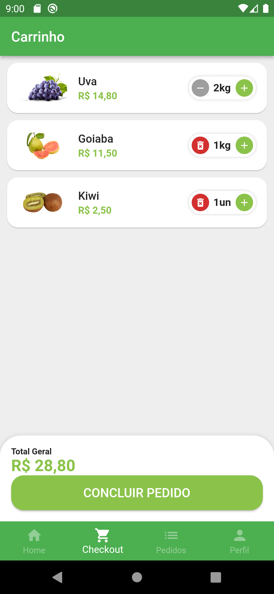
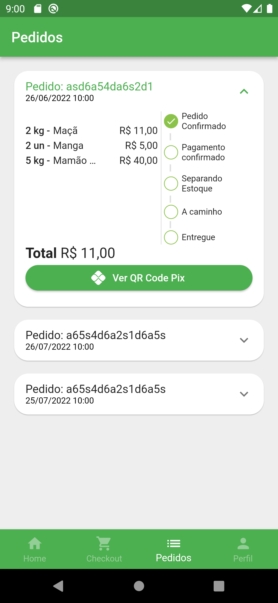
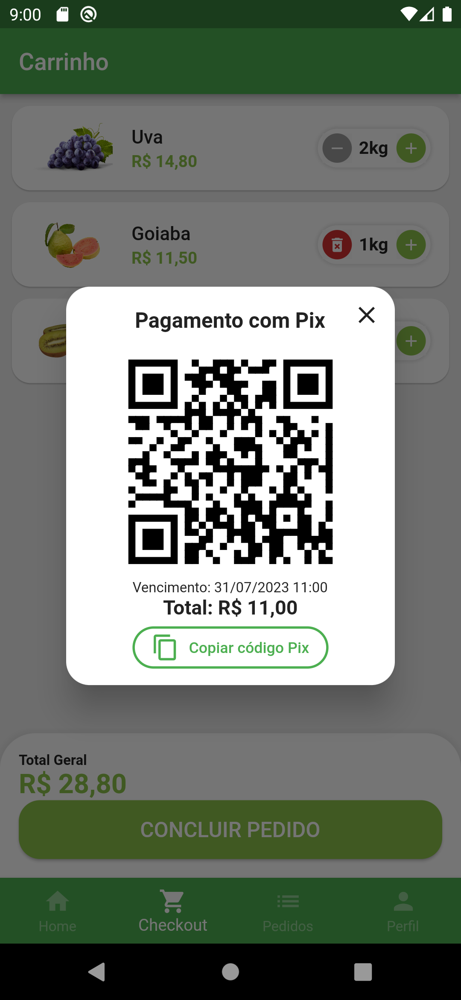
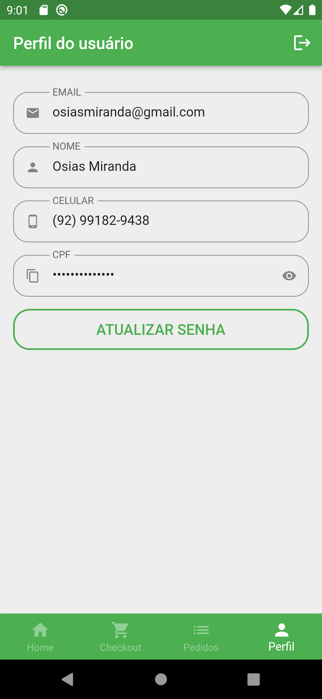

<h1 align="center">
    
    
</h1>
<h1 align="center"> 
	  
  GreenGrocer <=> Concluído 🥳..
  
</h1>

  
  
  

 <a href="#-sobre-o-projeto">Sobre</a> •
 <a href="#-tecnologias">Tecnologias</a> •
 <a href="#-layout">ScreenShot</a> • 
 <a href="#-autor">Autor</a> • 
 <a href="#-user-content--licença">Licença</a>

## 💻 Sobre o projeto

 GreenGrocer- é um aplicativo para aprendizado de desenvolvimento de interface com flutter.
Projeto desenvolvido no treinamento **Startto.dev** oferecido pelo professor Daniel Ciolfi e equipe.

---

## 🛠 Tecnologias

- [x] Flutter 3.0.5
- [x] Dart
- [x] intl
- [x] add_to_cart_animation
- [x] flutter_launcher_icons
- [x] fluttertoast
- [x] mask_text_input_formatter
- [x] qr_flutter
- [x] shimmer
- [x] Git
- [x] Github
- [x] GetX

---

## 🎨 **ScreenShot**

O screenshot da aplicação:

---

## 🦸‍♂️ **Autor**

<a href="https://github.com/osiasmiranda">
 
  
 <b>Osias Miranda</b></a> <a href="https://github.com/osiasmiranda" title="githubosias">🚀</a>

Feito com ❤️ por Osias Miranda 👋🏽 Entre em contato!

---

## 📝 Licença

Este projeto esta sobe a licença [MIT](./LICENSE).
